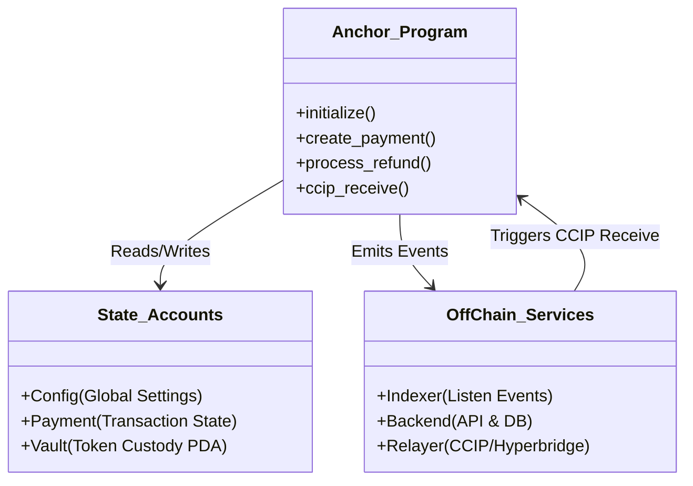

# Pay-Chain SVM (Solana) Smart Contract PRD

> **Component**: SVM Smart Contracts (Solana)
> **Status**: Implementation In Progress
> **Framework**: Anchor

## 1. Overview

The **Pay-Chain SVM Smart Contracts** module acts as the high-performance execution layer for the cross-chain stablecoin payment gateway on Solana. It handles asset custody, cross-chain message routing via CCIP, atomic token swaps via Jupiter, and fee management using Anchor's secure account validation.

### Key Objectives
1.  **Trustless Execution**: Uses PDA (Program Derived Address) constraints to ensure funds can only be moved by valid cross-chain messages or authorized refunds.
2.  **Asset Agnosticism**: Accepts any SPL Token (USDC, SOL, etc.) and swaps to the target currency automatically via Jupiter Aggregator.
3.  **Fail-Safe Mechanism**: Guaranteed 100% principal refund if the cross-chain transaction fails.
4.  **Modular Architecture**: Separated logic for State, Instructions, and Errors for maximum auditability.

---

## 2. Workflow Diagrams

### 2.1 User Flow
How the user interacts with the system from the frontend through to blockchain confirmation.

```mermaid
sequenceDiagram
    actor User
    participant Frontend
    participant Backend
    participant Wallet as Phantom/Solflare
    participant Program as PayChainProgram
    participant Jupiter

    User->>Frontend: Select Payment Request
    Frontend->>Backend: Request Payment Details (Target Chain/Token)
    Backend-->>Frontend: Return txData (calldata) + Estimated Fees
    
    User->>Frontend: Click Pay (Swapping SOL -> USDC if needed)
    
    rect rgb(20, 20, 20)
        Note right of Frontend: Atomic Instruction Composition
        Frontend->>Frontend: Compose Swap IX (Jupiter)
        Frontend->>Frontend: Compose CreatePayment IX (PayChain)
    end
    
    Frontend->>Wallet: Prompt Transaction Signature (Atomic)
    User->>Wallet: Sign Transaction
    Wallet->>Program: Submit Transaction
    
    Program->>Jupiter: Execute Swap (CPI)
    Jupiter-->>Program: Return Output Tokens
    Program->>Program: Lock Funds in Vault (PDA)
    Program->>Program: Emit PaymentCreated Event
    
    Program-->>Wallet: Transaction Confirmed
    Frontend->>Backend: Subscribe to Tx Status
    Note right of Program: Backend Indexer picks up Event
    Backend-->>Frontend: Update Status: "Processing Cross-Chain"
```



### 2.2 Payment Flow
The lifecycle of a payment from Solana execution to EVM destination settlement.

```mermaid
flowchart TD
    subgraph Solana [Solana Chain]
        S_User[User] -->|Calls| S_Program[PayChain Program]
        
        S_Program -->|1. Swap (Optional)| S_Jup[Jupiter Aggregator]
        S_Jup -->|Output Tokens| S_Program
        
        S_Program -->|2. Lock Funds| S_Vault[Vault PDA]
        S_Program -->|3. Calc Fee| S_Config[Config State]
        
        S_Program -->|4. Emit Event| S_Event[PaymentCreated Event]
        
        S_Event -.->|Indexer| S_Relayer[Off-Chain Relayer / CCIP]
    end

    subgraph Bridge [CCIP Network]
        S_Relayer -->|Cross-Chain Message| B_Network[Chainlink CCIP]
    end

    subgraph EVM [Destination EVM Chain]
        B_Network -->|Receive| D_Gateway[EVM Gateway]
        D_Gateway -->|Unlock/Mint| D_Receiver[Merchant Wallet]
    end
```

### 2.3 Application Flow (Data Logic)
How the smart contracts interact with off-chain components (Backend, Indexer) and State Accounts.



---

## 3. System Architecture

The system uses a **PDA-based Authority** model. The `Config` account acts as the central authority logic, while `Vault` accounts are PDAs derived from the Config, ensuring no external user can touch the funds.

### Directory Structure
```
programs/pay-chain/src/
├── lib.rs              # Entry point (Program ID & instruction routing)
├── state/              # Account definitions (storage)
│   ├── config.rs       # Global configuration (Fees, Authorities, Chain ID)
│   ├── payment.rs      # Payment & Request structs
│   └── vault.rs        # Vault logic
├── instructions/       # Logic implementation
│   ├── initialize.rs             # Setup config
│   ├── create_payment.rs         # Outbound payment (SVM -> EVM)
│   ├── receive_cross_chain.rs    # Inbound CCIP (EVM -> SVM)
│   ├── swap.rs                   # Jupiter Adapter
│   ├── refund.rs                 # 100% Principal Refund Logic
│   └── create_payment_request.rs # Merchant Logic
├── errors.rs           # Custom error codes
└── events.rs           # Indexer events
```

---

## 4. Data Models (State)

### 4.1 Global Config (`Config`)
Stores protocol-wide settings.
- `authority`: Protocol Admin (initially deployer).
- `fee_recipient`: Wallet receiving protocol fees.
- `router`: Chainlink CCIP Router address (for cross-chain verfs).
- `chain_id`: Dynamic CAIP-2 ID (e.g., `solana:5eykt...`) for multi-network support.
- `fee_rate_bps`: Fee percentage (e.g., 30 bps = 0.3%).
- `fixed_base_fee`: Minimum flat fee (e.g., 0.50 USDC).

### 4.2 Payment State (`Payment`)
Represents a single transaction lifecycle.
- `payment_id`: Unique 32-byte hash.
- `sender`: Payer's public key.
- `receiver_bytes`: Recipient address (EVM address or Solana Pubkey).
- `status`: `Pending`, `Processing`, `Completed`, `Failed`, `Refunded`.
- `amount`: Principal amount (excluding fee).
- `fee`: Protocol fee collected.

---

## 5. Instruction Set (API)

### 5.1 Admin
- **`initialize(router: Pubkey, chain_id: String)`**
    - Sets up the Global Config.
    - Defines fee structure and CCIP Router.

### 5.2 Core Payments
- **`create_payment(...)`**
    - **Inputs**: `payment_id`, `dest_chain_id`, `amount`, `receiver`.
    - **Logic**:
        1. Calculates fee (Max(Percentage, Fixed)).
        2. Transfers `Amount + Fee` from Sender to Vault (PDA).
        3. Emits `PaymentCreated` event for off-chain Relayers/CCIP.
    - **State**: Creates `Payment` account with status `Pending`.

- **`process_refund()`**
    - **Logic**: Returns 100% of the principal amount to the sender if status is `Failed`.
    - **Security**: Only callable if `status == Failed`.

### 5.3 Cross-Chain (CCIP)
- **`ccip_receive(message: Any2SVMMessage)`**
    - **Logic**: 
        1. Validates message source via CCIP Router.
        2. Unlocks funds from Vault to Receiver (if bridging back).
        3. Or updates status to `Completed` if confirming payment.

### 5.4 DEX Integration (Jupiter)
- **`swap_tokens(data: Vec<u8>)`**
    - **Logic**: Generic CPI Wrapper.
    - **Usage**: Allows frontend to compose a `Jupiter Swap` instruction followed by `create_payment` in a single atomic transaction. The contract validates the swap output guarantees funds for payment.

---

## 6. Deployment & Configuration

### Prerequisites
- Rust & Cargo (`stable`)
- Solana CLI (`v1.16+`)
- Anchor CLI (`v0.29+`)

### Environment Variables (.env)
Create a `.env` file in the root:
```ini
ANCHOR_PROVIDER_URL=https://api.devnet.solana.com
ANCHOR_WALLET=~/.config/solana/id.json
PROGRAM_ID=Fg6PaFpoGXkYsidMpWTK6W2BeZ7FEfcYkg476zPFsLnS
CCIP_ROUTER_ADDRESS=TODO_INSERT_ROUTER_KEY
JUPITER_PROGRAM_ID=JUP6LkbZbjS1jKKwapdHNy74zcZ3tLUZoi5QNyVTaV4
CHAIN_ID=solana:EtWTRABZaYq6iMfeYKouRu166VU2xqa1 # Devnet Genesis Hash
```

### Deployment Commands
```bash
# 1. Install Dependencies
npm install

# 2. Build
anchor build

# 3. Test
anchor test

# 4. Deploy (Migration Script)
npx ts-mocha migrations/deploy.ts
```

## 7. Security & Audit
- **PDA Constraints**: All Vault interactions require PDA signatures (`seeds=[b"vault", config.key]`).
- **Status Checks**: State machine enforces strict transitions (`Pending` -> `Refunded` is invalid without `Failed`).
- **Reentrancy**: Anchor's account model naturally prevents reentrancy, but Checks-Effects-Interactions pattern is strictly followed.
